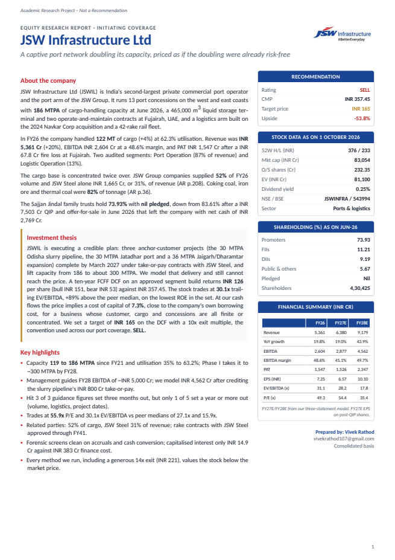
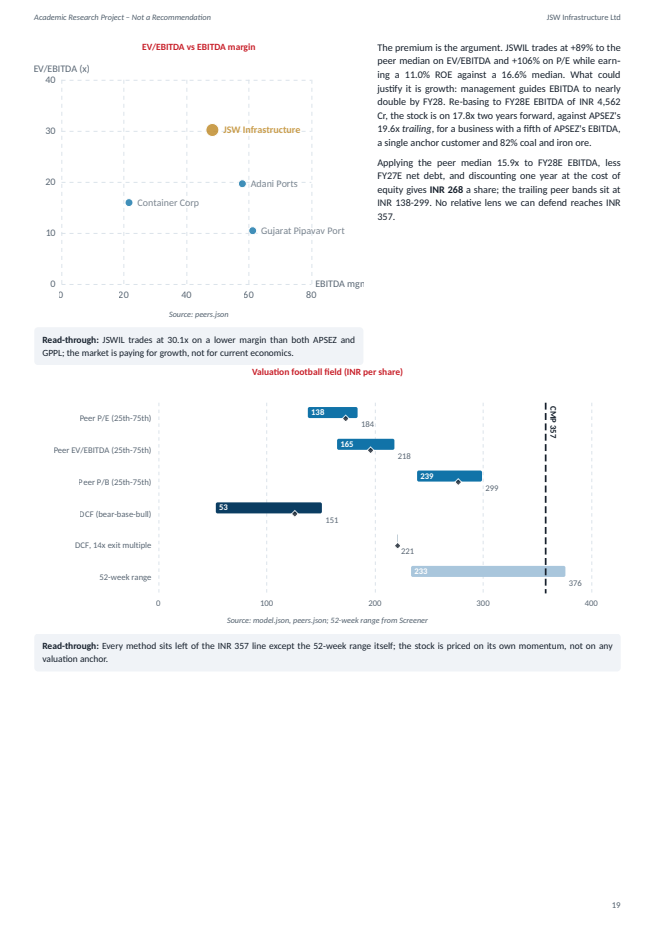
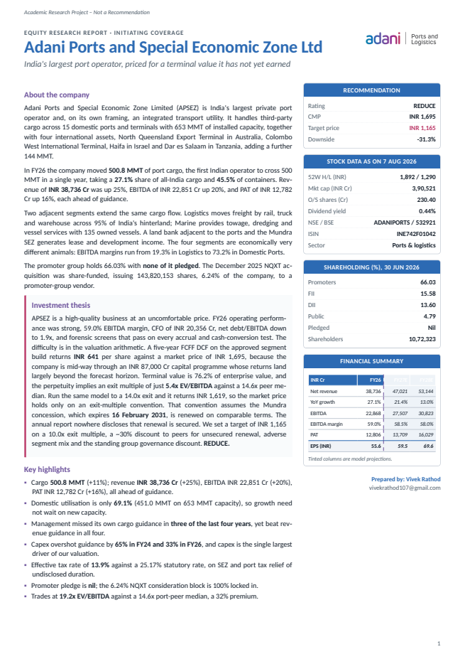
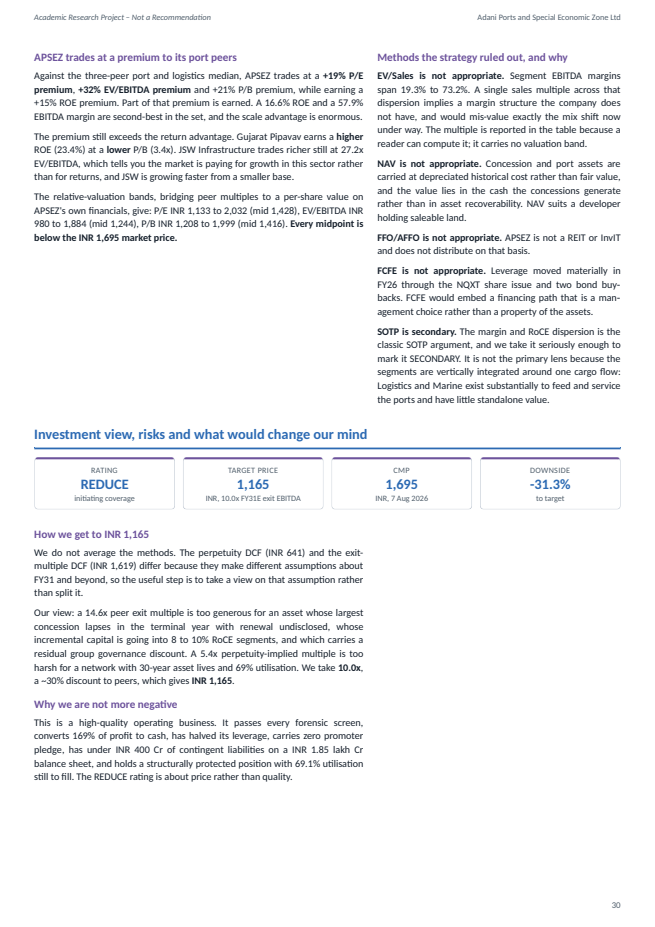
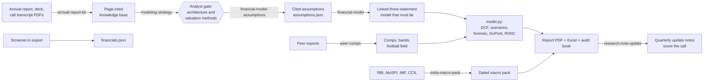

# ERIP: Equity Research Intelligence Pipeline

An AI-assisted pipeline that turns a listed Indian company's own filings into a sell-side style
initiating-coverage report: a 20 to 35 page A4 PDF, a linked Excel model, and an audit trail that
cites every forecast assumption to a page.

It runs as a set of [Claude Code](https://claude.com/claude-code) skills. Each stage owns one
artefact and hands it to the next, and the analyst approves the business architecture and the
assumptions before any valuation is computed.

> **Academic research project. Not investment advice.** See the [disclaimer](#disclaimer).

---

## Sample output

| Company | Rating | Target | Price at cover | Report | Model | Audit trail |
|---|---|---|---|---|---|---|
| **JSW Infrastructure Ltd** (JSWINFRA) | SELL | INR 165 | INR 357.45 (1 Oct 2026) | [PDF, 21 pp](reports/JSWINFRA/JSW%20Infrastructure%20-%20Equity%20Research%20Report.pdf) | [Excel](reports/JSWINFRA/JSW_Infrastructure_Ltd_ERIP_Model.xlsx) | [assumptions, strategy, comps, macro](reports/JSWINFRA/audit/) |
| **Adani Ports and SEZ Ltd** (ADANIPORTS) | REDUCE | INR 1,165 | INR 1,695 (7 Aug 2026) | [PDF, 32 pp](reports/ADANIPORTS/Adani%20Ports%20-%20Equity%20Research%20Report.pdf) | [Excel](reports/ADANIPORTS/Adani_Ports_and_Special_Economic_Zone_Ltd_ERIP_Model.xlsx) | [assumptions, strategy, comps, macro, audit book](reports/ADANIPORTS/audit/) |

<table>
<tr>
<td></td>
<td></td>
</tr>
<tr>
<td></td>
<td></td>
</tr>
</table>

### What the JSW Infrastructure note argues, in brief

- The FY27-FY28 build-out is lower-risk than it looks: 96 of the 117 MTPA being added is take-or-pay
  capacity for the anchor customer, JSW Steel. The report credits it in full, including the slurry
  pipeline's INR 800 Cr EBITDA disclosed by the CFO.
- Even so, a ten-year FCFF DCF returns INR 126 a share. At these cash flows the market price
  implies a cost of capital of about 7.3%, close to the company's own borrowing cost.
- A guidance scorecard built from old earnings-call transcripts shows management hitting 3 of 3
  near-term figures and 1 of 5 set a year or more ahead.
- Four falsifiers, each with a metric, threshold and date, define what would change the view.

---

## How it works



Nine phases, each ending in a checkpoint:

| Phase | Output | Gate |
|---|---|---|
| 0 Recall and profile | Knowledge brief from previous reports, company profile, peer proposal | Analyst confirms entity and peers |
| 1 Scope | Document checklist with the company's real filing URLs | Documents supplied |
| 2 Knowledge base | Page-level markdown, tables, classified images, brand palette | Palette approved |
| 3 Model | Modelling strategy, cited assumptions, comps, three-statement model, valuation | **Analyst approves the architecture, then the assumptions** |
| 4 Macro | Dated, staleness-audited macro and industry figures, reconciled into the WACC | |
| 5 Charts | 19 charts generated from the data files, never typed in | |
| 6 Write | Report HTML assembled from the data, every claim numbered or cited | |
| 7 Verify | Layout gate (page fill, clipping), 7pt type audit, figure tracing, workbook reconciliation | All gates pass |
| 8 Retrospective | Call, falsifiers and lessons written back for the next report | |

### Design choices that separate it from a template

- **The architecture is decided before the numbers.** A modelling-strategy stage classifies each
  segment's economics (capacity x utilisation x realisation, volume x price, order book, and so on)
  and which valuation methods fit, and can refuse a company outright (banks, NBFCs, insurers).
- **Every assumption carries a page citation and a confidence level**, or is declared "not enough
  evidence" instead of being guessed.
- **The DCF has to fund itself.** A linked P&amp;L, balance sheet and cash flow must tie every year,
  and the DCF's free cash flow is cross-checked against it.
- **Methods are reconciled, not averaged.** Where the DCF and the multiples disagree, the report
  says why; a reverse DCF shows what the price assumes.
- **Forensic screens are interpreted, not printed**: accruals, cash conversion, capitalised interest,
  Altman Z' and Piotroski with the failed tests named.
- **The loop closes.** Each call is logged with falsifiers and a review date; update notes score it.

---

## Repository layout

```
skills/
  equity-research-report/        orchestrator: phases, model.py, charts, render, QA gates
  annual-report-kb/              PDF -> page-cited knowledge base
  modeling-strategy/             segment architecture and valuation-method gate
  financial-model-assumptions/   evidence-cited forecast assumptions
  financial-model/               linked three-statement model (live-formula Excel)
  peer-comps/                    comps table, relative-valuation bands, peer betas
  india-macro-pack/              dated macro figures with staleness audit
  research-note-update/          quarterly update notes that score the standing call
reports/
  JSWINFRA/                      report PDF, Excel model, charts, audit trail
  ADANIPORTS/                    report PDF, Excel model, charts, audit trail
docs/img/                        report previews
```

Source documents (annual reports, Screener exports) and the derived knowledge bases are not
included: they are third-party material. The audit files cite them by page.

## Running it

Requirements: Claude Code, Python 3.12 with `marker-pdf`, `pypdfium2`, `openpyxl`, `matplotlib`,
`pillow`; WeasyPrint for the PDF (native, or inside WSL on Windows); Node.js for the chart renderer.

```bash
# install the skills where Claude Code can find them
cp -r skills/* ~/.claude/skills/
# chart renderer dependencies
cd ~/.claude/skills/equity-research-report/scripts/erip && npm install
```

Then, in Claude Code: `/equity-research-report <company name>` and follow the phase checkpoints.

---

## Disclaimer

These reports are academic research projects prepared to demonstrate equity research methodology.
They are **not** recommendations to buy, sell or hold any security, are not investment advice, and
do not take account of any person's objectives or circumstances. Figures come from the companies'
public filings and other sources believed reliable, but accuracy is not guaranteed, and the reports
are dated: they do not reflect results or events after their cover dates. The author holds no
position in the securities discussed.

**Author:** Vivek Rathod · vivekrathod107@gmail.com

---

© 2026 Vivek Rathod. All rights reserved. This repository is published for viewing and evaluation. No part of the code or
reports may be reused, modified or redistributed without written permission. For licensing or engagements:
vivekrathod107@gmail.com
